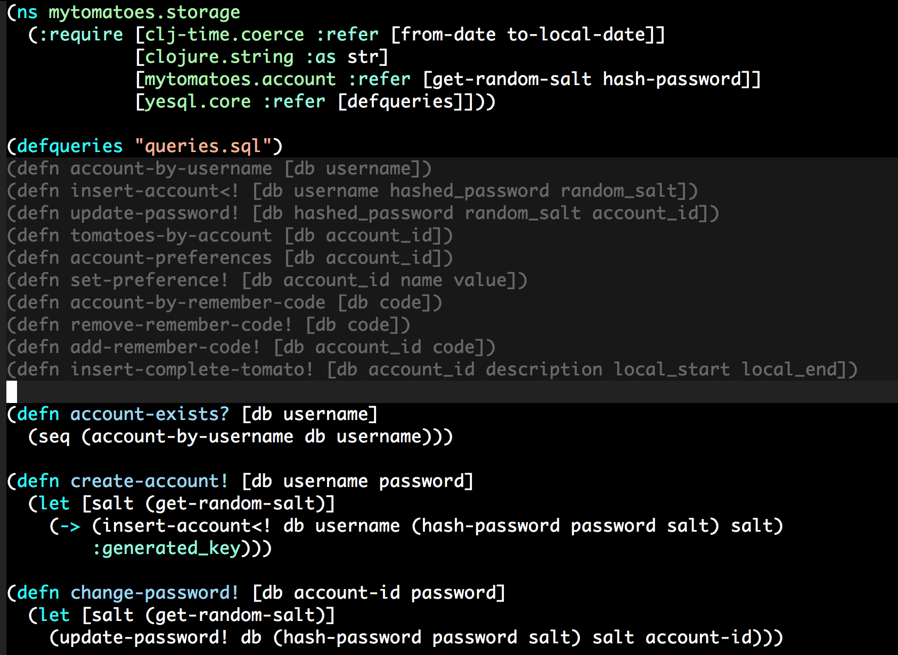

# yesql-ghosts

It display ghostly [yesql](https://github.com/krisajenkins/yesql) defqueries
inline. Like this:



The ghostly displays are inserted when cider-mode is entered, and updated every
time you save.

## Installation

I highly recommend installing yesql-ghosts through elpa.

It will soon be available on [marmalade](http://marmalade-repo.org/) and
[melpa](http://melpa.milkbox.net/):

    M-x package-install yesql-ghosts

You can also install the dependencies on your own, and just dump
yesql-ghosts in your path somewhere:

 - <a href="https://github.com/magnars/s.el">s.el</a>
 - <a href="https://github.com/magnars/dash.el">dash.el</a>
 - <a href="https://github.com/clojure-emacs/cider">cider</a>

## Setup

Add this:

```cl
(require 'yesql-ghosts)
```

somewhere, and the ghosts will appear once you enter `cider-mode` in a buffer
with `(defqueries "...")` that points at an existing resource. To refresh, save
or revert the buffer.

If you want to set up your own mechanisms to display and hide the ghosts,
set `yesql-ghosts-show-ghosts-automatically` to `nil`, and use
`yesql-ghosts-display-query-ghosts` and `yesql-ghosts-remove-overlays` yourself.

You can also include the descriptions from yesql, you know these ones:

```sql
-- name: insert-account!
-- Inserts the account
```

by setting `yesql-ghosts-show-descriptions` to `t`. I find it a bit much,
personally.

## License

Copyright (C) 2015 Magnar Sveen

Authors: Magnar Sveen <magnars@gmail.com>

This program is free software; you can redistribute it and/or modify
it under the terms of the GNU General Public License as published by
the Free Software Foundation, either version 3 of the License, or
(at your option) any later version.

This program is distributed in the hope that it will be useful,
but WITHOUT ANY WARRANTY; without even the implied warranty of
MERCHANTABILITY or FITNESS FOR A PARTICULAR PURPOSE.  See the
GNU General Public License for more details.

You should have received a copy of the GNU General Public License
along with this program.  If not, see <http://www.gnu.org/licenses/>.
